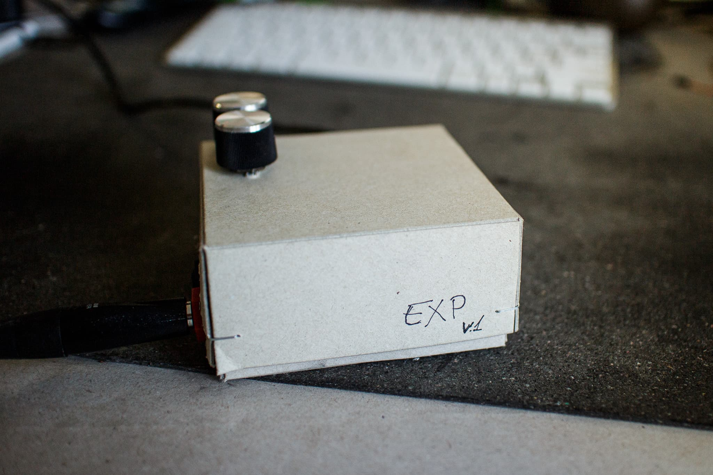
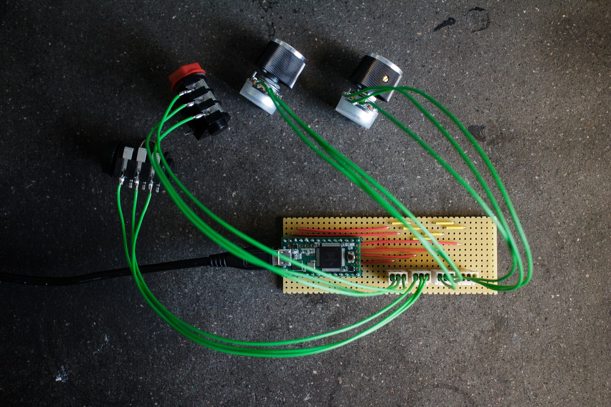
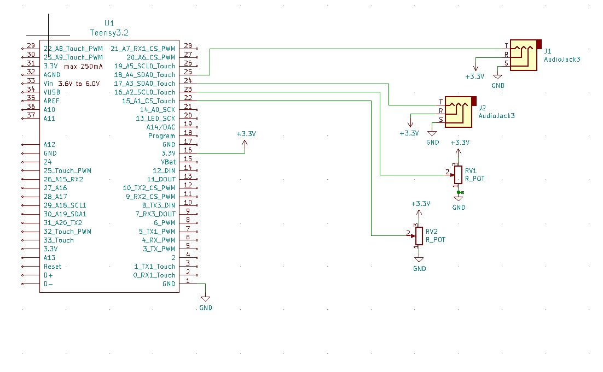

# exp
*2020, LFSaw ([interaction](http://tai-studio.org) | [music](http://lfsaw.de))*

A teensy usb-MIDI expression pedal interface.
This very basic implementation and hardware layout might be a good starting-point to build your own MIDI USB-interface based on a Teensy microcontroller.
It has 4 controls: 2 rotary potentiometers and two plugs for expression pedals.

For each HW-input the controller sends out a MIDI pitchbend message (14bit) on its own MIDI channel. The internal resolution of the hardware is limited to 13bit, though, since the ADC on the Teensy only supports up to 13bit (and it is already quite noisy).

## Requirements

### Hardware
+ one Teensy 3.2 (or similar) and USB cable
+ two linear potentiometers
+ two 3-pole 1/4" jacks
+ a breadboard for beta-testing
+ one or two expression pedals (I use a Boss FV500L but anything should work, really)

### Software
+ [Teensyduino](https://www.pjrc.com/teensy/td_download.html) (>= Version 1.53)

For an overview on Teensy-based usb-MIDI, see the the [PJRC website](https://www.pjrc.com/teensy/td_midi.html).

## SuperCollider

[SuperCollider](http://supercollider.github.io) has a powerful controller interfacing library extension called [Modality](http://modality.github.io) which I highly recommend checking out. I included a rudimentary description file in this repository in case you want to use the `exp` box with SC3.

## Thanks

Thanks go to [Constantin Engelmann](http://constantinengelmann.de/) for pointing me to the Teensy. He does awesome work otherwise as well!

If you find this useful, you can buy me a [coffee](https://ko-fi.com/lfsaw) or purchase some of my [albums](http://lfsaw.bandcamp.com).

